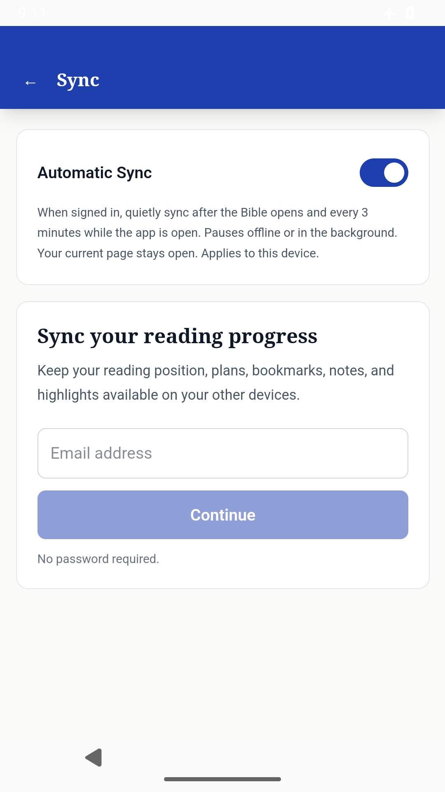

# Automatic Sync — September 14, 2026

Reader implementation: `a7cb7c0f1cf52e567806b46f75a838de19cd3749`.
Android build configuration correction: `3f30bdb1dd9002a4d9a50b7545fe6bbc6a5b7697` (only `.github/workflows/android-debug.yml` changed).

Implemented a device-local, opt-in Automatic Sync switch under Settings → Sync. It starts after the Bible and local annotations render, waits 10 seconds, and uses a 3-minute interval after successful completion. Foreground and connectivity guards, text-editor deferral, one in-flight sync, and 6/12/24/30-minute failure backoff keep it quiet. Missing or revoked sign-in waits for a session change. A completed sync updates Settings without navigating the reader.

Only changed personal records travel over the network. Typical small cycles use three requests; first synchronization and histories over 500 records take more. Local hashing still scans the supported record set, so 3 minutes balances freshness and work. No phone battery measurement was used to choose the interval.

The manual sync implementation needed safeguards before automatic use: three-way local merges now preserve notes, deletions, additions, plan progress and reading positions edited during requests; annotation React state uses the same merge; unchanged local groups are not rewritten; pulled-only revisions are remembered. Manual/automatic calls share an in-flight operation, and conflict/account mutations are serialized.

Local checks: 207 reader unit tests, 105 protocol tests, production reader build, and clean diff checks passed. Real CUA browser verification at 390 × 844 showed the control/explanation, setting persistence after reload, Bible opening and Genesis 1 → 2 navigation. That local browser was signed out; it did not establish a real automatic transfer.

Reader CI: https://github.com/edydex/heritage_study_bible/actions/runs/34896684246 — success, including 33 browser end-to-end cases.
Initial Android run: https://github.com/edydex/heritage_study_bible/actions/runs/34896686951 — stopped before compiling because the setup action requested the retired `tools` package. Its log is retained. The corrected action explicitly selects `platform-tools`; its documented input is https://github.com/android-actions/setup-android/blob/v3/action.yml.
Corrected Android run: https://github.com/edydex/heritage_study_bible/actions/runs/34896921200 — success. All four native acceptance cases passed; package identity, update signer, bundled web assets and source metadata passed before publication.

New package acceptance requires the rendered switch, native Preferences persistence across activity restart, and offline Bible opening with automatic sync enabled. Existing encrypted storage and Community screen tests remain required.

Still separate: physical-phone battery/use measurements, real sign-in return, and a signed-in two-device automatic cycle. No Community server deployment or component-set pin changed. No translation provider was called.

[Android Preview 2](https://github.com/edydex/heritage_study_bible/releases/tag/v1.1.33-preview.2) is published. The actual downloaded APK is 54,402,791 bytes, version code 36, with SHA-256 `c65220771fd4b66b72cb3742e96a16064ae486ec904e85af2f2b31a6972c3abd`. Its downloaded checksum file and metadata match the source and the four native XML results. The packaged Sync screen was visually inspected.

